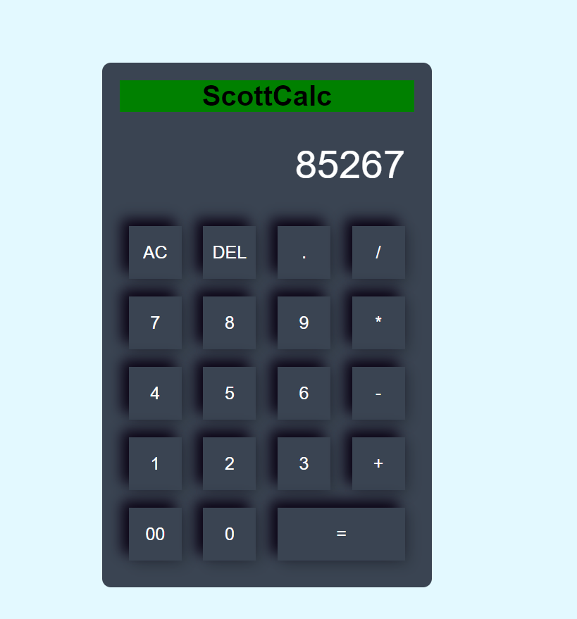

# Scottcalc - Web Calculator

Welcome to Scottcalc, a sleek and user-friendly web-based calculator for all your computation needs!

## Overview

Scottcalc is a feature-rich calculator designed to provide a seamless and intuitive calculation experience. Whether you're a student, professional, or anyone in need of quick calculations, Scottcalc has got you covered.

## Features

- **Basic Arithmetic:** Perform addition, subtraction, multiplication, and division with ease.
- **Scientific Functions:** Access advanced functions like square root, exponentiation, and trigonometric calculations.
- **History Tracking:** Review your previous calculations with a handy history feature.
- **Responsive Design:** Enjoy a consistent and user-friendly experience across various devices.

## Getting Started

To use Scottcalc, simply [access the live demo](https://Scott-TechStar.github.io/scottcalc/) or follow these steps to run it locally:

1. Clone the repository: `git clone https://github.com/your-username/scottcalc.git`
2. Navigate to the project directory: `cd scottcalc`
3. Open `index.html` in your preferred web browser.

## Usage

1. Enter your calculations using the on-screen buttons or your keyboard.
2. Click the equal sign (`=`) to see the result.
3. Explore the scientific functions and history features for more advanced use.

## Contributing

We welcome contributions from the community! If you'd like to contribute to Scottcalc, please follow our [contribution guidelines](CONTRIBUTING.md).

## Support

For any issues, bug reports, or feature requests, please open an [issue](https://github.com/Scott-TechStar/scottcalc/issues).

## License

This project is licensed under the [MIT License](LICENSE).

---

Happy calculating with Scottcalc!
